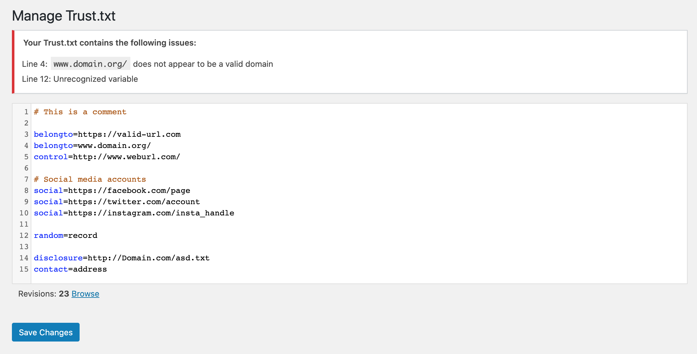
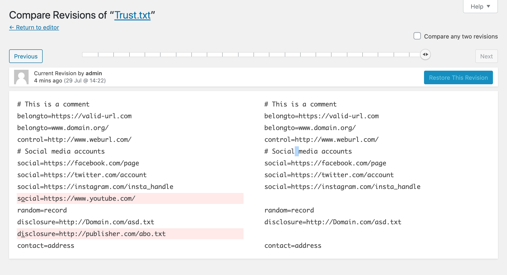
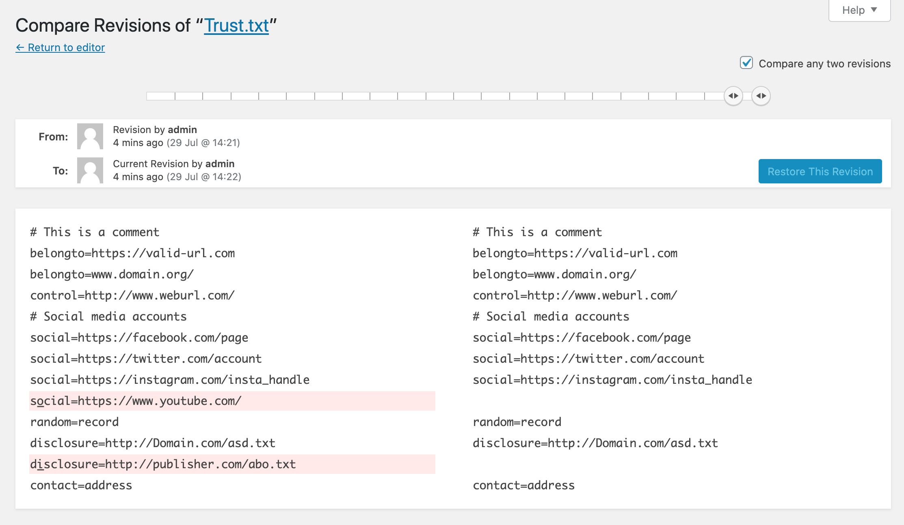

# Trust.txt Manager for WordPress

Trust.txt is an effort by [JournalList](https://journallist.net/about) to systematically and transparently disclose connections between journalists, publishers & associations. The concept of a `trust.txt` file borrows heavily from two previous very successful efforts improving the overall experience of the internet: `robots.txt` and `ads.txt`. With both, website publishers are able to create a small and very manageable file that they have full control over that helps platforms and advertisers improve the overall ecosystem, and thereby the experience for users. So it is with trust.txt.
This plugin provides a way to create & manage your trust.txt from within WordPress, just like any other content asset. The validation logic baked into the plugin helps avoid malformed records.

## Requirements:

* Requires PHP 5.3+.
* Requires WordPress 4.9+. Older versions of WordPress will not display any syntax highlighting and may break JavaScript and/or be unable to localize the plugin.
* Rewrites need to be enabled. Without rewrites, WordPress cannot know to supply /trust.txt when requested.
* Your site URL must not contain a path (e.g. https://example.com/site/ or path-based multisite installs). While the plugin will appear to function in the WP admin, it will not display the contents at https://example.com/site/trust.txt. This is because the plugin enforces [the specification](https://journallist.net/reference-document-for-trust-txt-specifications) as defined by JournalList, which requires that the trust.txt file be located at the root of a domain or subdomain.

## Installation:

1. Install and activate this plugin as per usual.
2. Go to Settings > Trust.txt and add the records you need. Ref: [trust.txt specification details](https://journallist.net/reference-document-for-trust-txt-specifications).
3. Your trust.txt file will appear at yoursite.com/trust.txt
4. Make sure to remove or rename any pre-existing trust.txt file from your web root as this plugin will NOT override it with the changes you make from the WordPress interface.

## Screenshots

Verbose error messages:

Fully revision history support:

Comparing two revisions:

## FAQ

### Can I use this with multisite?

Yes! However, if you are using a subfolder installation it will only work for the main site. This is because you can only have one trust.txt for a given domain or subdomain per the trust.txt spec. Our recommendation is to only activate Trust.txt Manager per-site.

## Credits

[10up](https://10up.com/) for developing the [ads.txt Manager](https://github.com/10up/ads-txt) this plugin is largely based off of.
[mangeshp](http://profiles.wordpress.org/mangeshp), [scodtt](https://profiles.wordpress.org/scodtt), [journallist](https://profiles.wordpress.org/journallist) for their contributions to the codebase.